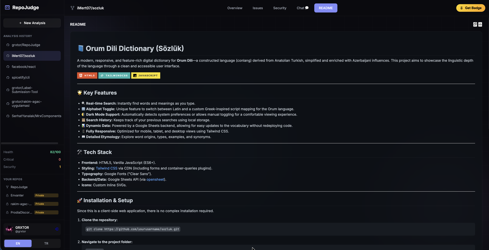

# RepoJudge 🔍

> AI-powered code analysis that reviews your GitHub repositories like a senior engineer.


### ✨ Key Features

| Feature | Description |
|---------|-------------|
| 🧠 **AI Code Analysis** | Deep analysis of your codebase using Google Gemini AI |
| � **Health Score** | Get a 0-100 score based on code quality, security, and best practices |
| 🐛 **Issue Detection** | Find bugs, security vulnerabilities, and architectural problems |
| 📝 **README Generation** | Auto-generate professional README.md files |
| 💬 **AI Chat** | Ask questions about your codebase with context-aware responses |
| � **Private Repos** | Analyze private repositories with GitHub OAuth |
| 🏷️ **Badge Generation** | Create embeddable repo badges for your README |

---

## � Product Showcase

### 1. Deep Code Analysis Dashboard
Get a comprehensive overview of your repository's health, including a calculated score, issue breakdown, and critical insights.


<br>

### 2. Automated README Generation
Transform your documentation instantly. RepoJudge analyzes your code structure and generates a professional Markdown file ready for GitHub.

<!-- Using a grid layout concept for comparison if possible, or just the image -->


<br>

### 3. Interactive Code Chat
Got questions? Chat with an AI that understands your specific repository context.

<!-- Placeholder for chat screenshot if available, otherwise description remains -->
> "How can I refactor the auth service?"
> "What security vulnerabilities exist in api.js?"

---### Prerequisites
- Node.js 18+
- GitHub OAuth App (for private repos)
- Google Gemini API Key

### Installation

```bash
# Clone the repository
git clone https://github.com/yourusername/repojudge.git
cd repojudge

# Install dependencies
npm install

# Configure environment
cp .env.example .env
# Edit .env with your API keys

# Start the server
npm start
```

### Runtime Keys (Frontend)

```env
GEMINI_API_KEY=your_gemini_api_key
GITHUB_CLIENT_ID=your_github_oauth_client_id
GITHUB_CLIENT_SECRET=your_github_oauth_client_secret
SESSION_SECRET=your_random_session_secret
```

These values are collected in the **API Settings** modal on first visit and sent to the backend via headers/query. `.env` is no longer required for these keys.

### GitHub Pages (Frontend + Remote Backend)

RepoJudge can run on GitHub Pages as a static frontend that talks to a separately hosted backend.

1. Deploy the Node/Redis backend (same codebase).
2. Build the static frontend:
   ```bash
   npm run build
   # or
   pnpm build
   ```
3. Configure GitHub Pages to serve the `/docs` folder.
4. Open `dashboard.html` and set:
   - Gemini API key
   - GitHub Client ID / Secret
   - Session secret

On first visit the site prompts for these values. If localStorage is available, they are stored on the client device.

If your backend is on a different origin, set `window.__API_BASE__` before `app.js` loads (for example in `public/index.html` and `public/dashboard.html`, or in `docs/` after build).

### Cloudflare Workers Backend

You can run the backend on Cloudflare Workers and keep the GitHub Pages frontend static.

1. Create KV namespaces:
   ```bash
   wrangler kv:namespace create repojudge_sessions
   wrangler kv:namespace create repojudge_cache
   ```
2. Update `wrangler.toml` with the KV IDs for `SESSIONS` and `CACHE`.
3. Deploy the worker:
   ```bash
   wrangler deploy
   ```
4. Point the frontend to the worker origin by setting:
   ```html
   <script>
     window.__API_BASE__ = 'https://your-worker.yourdomain.workers.dev';
   </script>
   ```
5. Update your GitHub OAuth App callback URL to:
   ```
   https://your-worker.yourdomain.workers.dev/auth/github/callback
   ```

The frontend still asks for `GITHUB_CLIENT_ID`, `GITHUB_CLIENT_SECRET`, `GEMINI_API_KEY`, and `SESSION_SECRET` on first visit.

## 🔧 GitHub OAuth Setup

1. Go to [GitHub Developer Settings](https://github.com/settings/developers)
2. Click "New OAuth App"
3. Fill in:
   - **Application name:** RepoJudge
   - **Homepage URL:** http://localhost:3000
   - **Authorization callback URL:** http://localhost:3000/auth/github/callback
4. Enter Client ID and Client Secret in the API Settings modal on the frontend

## 📦 Tech Stack

- **Backend:** Node.js, Express.js
- **AI:** Google Gemini 2.0 Flash
- **Frontend:** Vanilla HTML/CSS/JavaScript
- **Auth:** GitHub OAuth 2.0
- **Styling:** Custom CSS with dark theme

## 🎯 How It Works

1. **Paste a GitHub URL** or select from your repos
2. **AI analyzes** the codebase structure and key files
3. **Get a detailed report** with:
   - Health score (0-100)
   - Prioritized issues by severity
   - Security vulnerabilities
   - Auto-generated README
   - Competitor suggestions

## 📄 License

MIT License - feel free to use this project however you want!

## 🙏 Acknowledgments

- [Google Gemini AI](https://ai.google.dev/) for the powerful analysis engine
- [Boxicons](https://boxicons.com/) for beautiful icons
- [Inter Font](https://fonts.google.com/specimen/Inter) for clean typography

---

**Made with ❤️ by [grxtor](https://github.com/grxtor) [YongDo-Hyun](https://github.com/YongDo-Hyun)**
